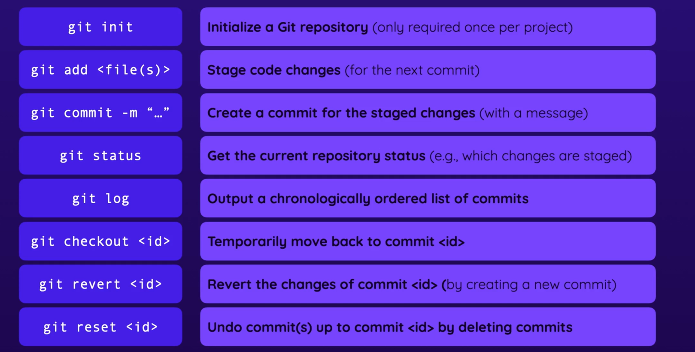

**Configure username and emailId for new git repo**
    - git config --global user.name "your-username"
    - git config --global user.email "your-email"

**Move between different commits**
    - git checkout <id>
    - Above command will allow to temporarly move to another commit using commit id
    - HEAD pointer basically describes or point towards which current commit is loaded.
    - By default HEAD pointer points to the latest commit

**Revert specific commit changes**
    - git revert <id>
    - By above command we can revert changes of commit by creating a new commit

**Revert multiple commits**
    - git reset --hard <id>
    - By above command, we can undo changes by deleting all commits since <id>

**useful git commands**

**What is branches in git**
    -  Branches are like a container which contains commits
    - feature branch is branch where you can implement feature specific commit without impacting the main branch.
    - You can merge the feature branch changes to main branch using below command:
        - First you should be on the branch which you want to be merge with main branch
        - After that execute below command:
            - git merge <branchName>
            - e.g. git merge main
    -`Naming convetion for branch`
        - It is common practice to use all the alphabets in lowercase
        - If there are multiple words then it's very common to separate multiple words with slashes("/")
        - Example: branch names would be "feature/blog", "dev/bugfix" etc
    - `Delete the branch`    
        - To delete the branch, first you have to move the other branch than the branch which you want to delete.
        - Example:
            - Let's say you are having two branch "main", "feature/jira-1234"
            - Now if you want to delete branch named "feature/jira-1234" then first you need to switch to main branch and from there you can trigger the command to delete the feature branch
            - git checkout main
            - git branch -D feature/jira-1234
            - Above command will delete the feature branch
    -`Check current active branch`
        - git branch
        - Above command will git list of branches available under the repo and the branch which is in active state it will get displayed with "*"
        - Example: "* main" (mainly highlighted in green color)
